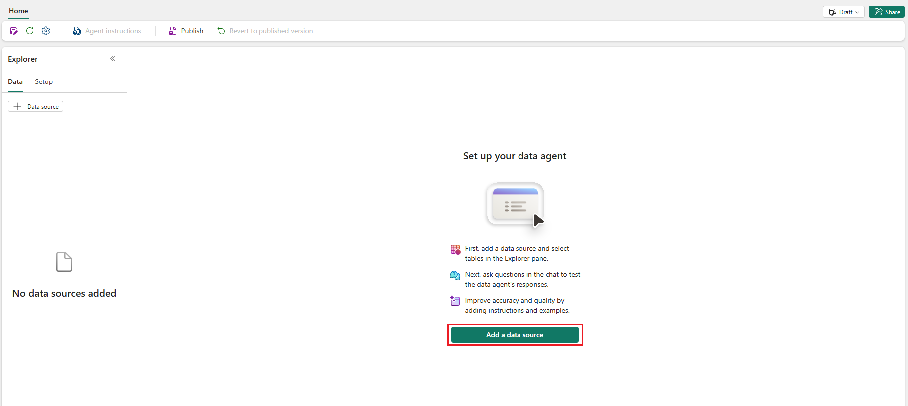
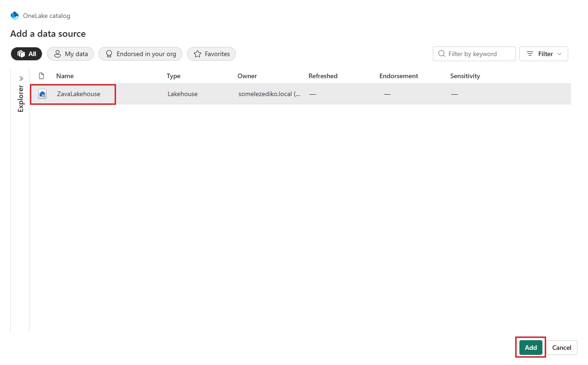
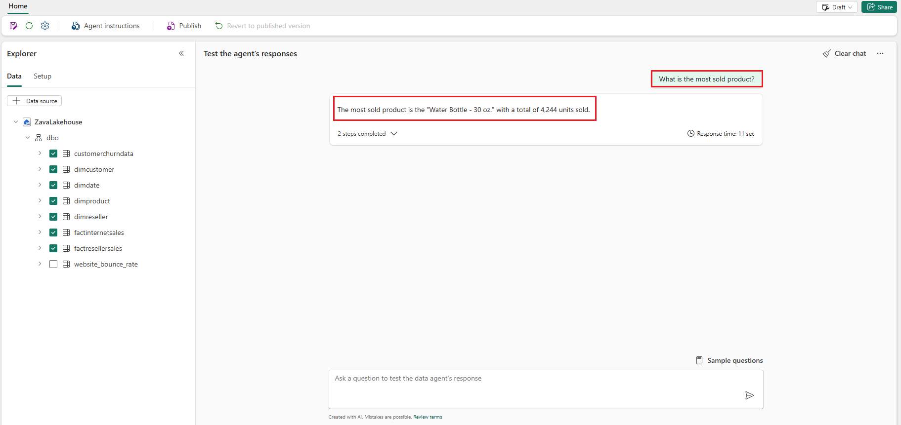
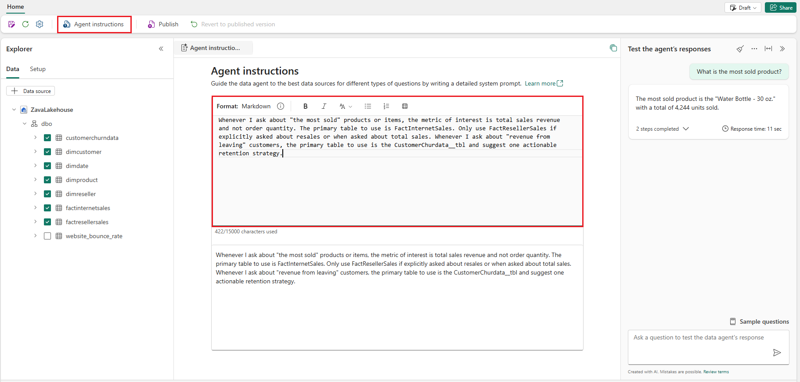
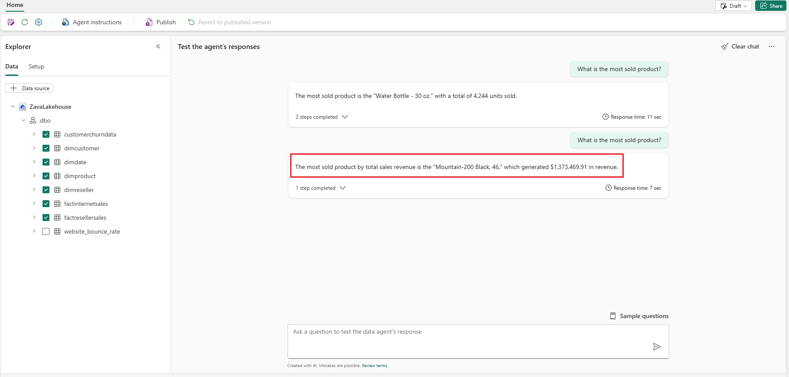
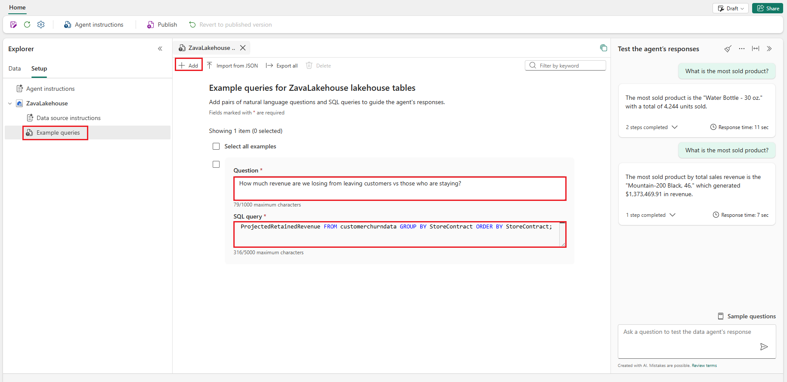
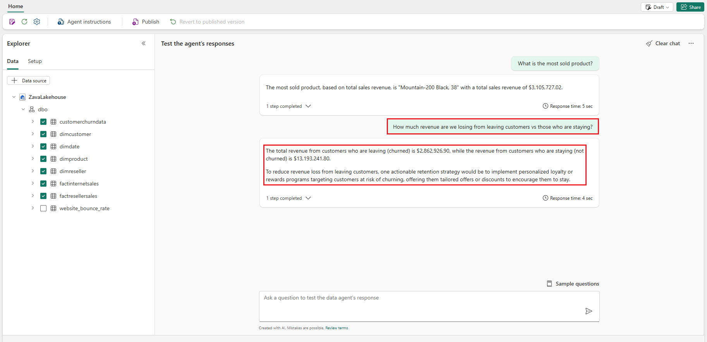
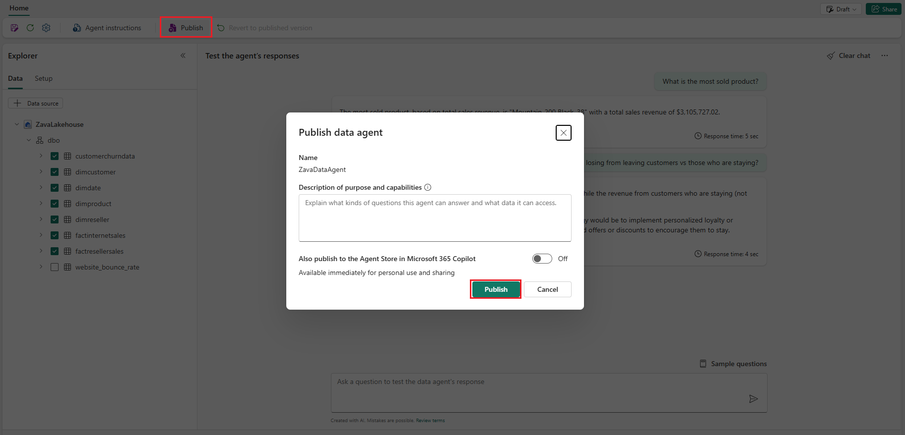
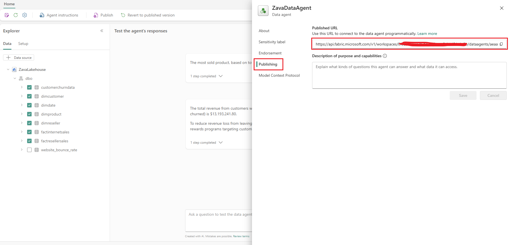

# Exercise 3: Build AI Agents with Fabric Data Agents

In this exercise, you step into Reta's shoes, a data scientist at Zava, to build AI agents using Fabric Data Agents. Fabric Data Agents allow you to create AI-powered agents that can interact with your data in Microsoft Fabric using natural language. You can use these agents to ask questions, generate insights, and automate tasks.

## Task 3.1: Create a Fabric Data Agent

1. On the left navigation pane, select your **ZavaWorkspace_@lab.LabInstance.Id** workspace then select **+ New Item** from the top menu.

    

2. In the **New Item** pane, search for **Data Agent (preview)** and select **Data Agent (preview)**.

    

3. Enter a name for the Data Agent, such as `ZavaDataAgent` then select **Create**.

4. Once the Data Agent is created, select the **Add a data source** button.

    

5. In the **Add a data source** pane, select **ZavaLakehouse** from the options then select **Add**.

    

6. On the left pane, under the *ZavaLakehouse* dropdown, expand **dbo** and select the following tables as shown in the screenshot.

    - dimcustomer
    - dimdate
    - dimproduct
    - dimreseller
    - factinternetsales
    - factresellersales

    

7. Help Zava gain insight on their most sold product by asking the Data Agent a question in the prompt box then select the **Send** button. For example, you can ask:

    - `What is the most sold product?`

    

8. Data agent answered the question fairly well based on the selected tables. However, the SQL query needs some improvement, it orders the products by order quantity or units sold and not the revenue generated.

9. To improve the query generation, let's provide some instructions to the data agent. Select on the **Agent Instructions** tab and enter the following instructions and then select the **Close (X)** button once done:

    - `Whenever I ask about "the most sold" products or items, the metric of interest is total sales revenue and not order quantity. The primary table to use is FactInternetSales. Only use FactResellerSales if explicitly asked about resales or when asked about total sales. Whenever I ask about "revenue from leaving" customers, the primary table to use is the CustomerChurdata__tbl and suggest one actionable retention strategy.`

    

10. Now, ask the same question again in the prompt box then select the **Send** button.

    - `What is the most sold product?`

    

11. This time, the SQL query generated by the data agent is more accurate and provides the correct answer based on total sales revenue.

12. In addition to instructions, you can also provide some examples to the data agent to further improve its performance. Under **Explorer** select on the **Setup** tab and select the **Example queries** option.

    

13. In the **Example queries for ZavaLakehouse lakehouse tables** pane, select the **+ Add** button and enter the following example with its corresponding SQL query. Then select the **Close (X)** button once done.

    | Question | SQL Query |
    |----------|-----------|
    | `How much revenue are we losing from leaving customers vs those who are staying?` | `SELECT StoreContract, Round(SUM(CASE WHEN Churn = 'Yes' THEN CAST(TotalAmount as FLOAT) * 12 ELSE 0 END), 2) AS ProjectedLostRevenue, Round(SUM(CASE WHEN Churn = 'No'  THEN CAST(TotalAmount as FLOAT) * 12 ELSE 0 END),2) AS ProjectedRetainedRevenue FROM customerchurndata GROUP BY StoreContract ORDER BY StoreContract;` |

    

14. Now, ask the same question in the prompt box then select the **Send** button.

    - `How much revenue are we losing from leaving customers vs those who are staying?`

    

15. Select on **Publish** button to publish the Data Agent.

    

16. Keep note of the public URL of the Data Agent, as you will need it in the next step.

    

### Next Step

> Select **Next >** to setup connections for the Microsoft Foundry agent.
