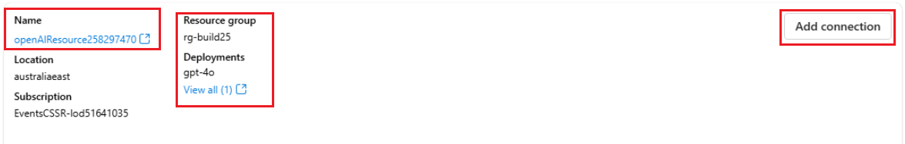

## Task 3.2: Establish Azure OpenAI and Fabric connections in Microsoft Foundry

Zava integrated all of their data sources using Microsoft Fabric, including customer feedback, sales
records, social media interactions. This created a unified, searchable knowledge base.

Let's continue stepping into the shoes of Reta, the Data Scientist to see how.

1. Open a new tab in your VM browser and sign in to the Azure Portal by clicking on `https://portal.azure.com`, enter your credentials if prompted (on the resources section). In the Azure portal, search for `rg-build25`. Select the resource group from the search results.

    

2. In your resource group search for and select **prj-build-@lab.LabInstance.Id** project then select the **Studio web URL** to launch Microsoft Foundry.

    

    > [!NOTE]
    > Make sure to close any pop-ups that may appear.

3. In the **prj-build-@lab.LabInstance.Id** project, scroll down to the bottom and select **Management center** from the left navigation pane.

    

4. In the **Management center**, select the **Connected resources** tab and then select the **+ New connection** button.

    

5. In the **New connection** pane, select **Azure OpenAI** from the list of connection types. You will find an Azure OpenAI resource with the *gpt-4o* already deployed. Click **Add connection** button to create a new connection (this model will serve as the base LLM for the Foundry agent). Press **Close**.

    

6. Now, create now a connection to the *Fabric Data Agent*. In the **New connection** dialog, select **Microsoft Fabric** from the list of connection types under **Agent Knowledge Tools**. Enter the required details to connect to the Fabric Data Agent you created in the previous task.

    - **workspace-id**: Paste the workspace ID you copied from Fabric Data Agent URL. The workspace ID is the alphanumeric string after **/workspaces/<workspace-id>/** in the URL.
    - **artifact-id**: Paste the artifact ID you copied from Fabric Data Agent URL. The artifact ID is the alphanumeric string after **/dataagents/<artifact-id>/** in the URL.
    - **Connection name**: Enter `ZavaDataAgent`

    Select the **Add connection** button to create a new connection.

    

    > [!NOTE]
    > If you encounter connection issues, check that you haven’t accidentally copied a '/' symbol. You can verify this by selecting the **is secret** checkbox.

7. Both the Azure OpenAI *gpt-4o* model and the *Fabric Data Agent* are now connected. We can proceed to create a Foundry agent that uses them.

### Next Step

> Select **Next >** to Build a Foundry agent grounded with Fabric data.
